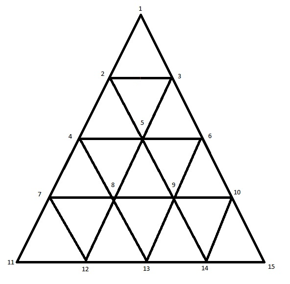
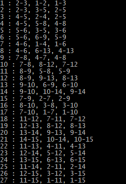

# How Many Triangles?
Solves the **"how many triangles in this shape?"** types of riddles

### Example


### Usages

The  application takes an input of lines made up of indices of nodes (lines intersections) in the shape.

Mark each node with a unique index and create a `Line` from the indices of each actual (full) line in the shape:



```csharp
Line[] example =
{
    //Horizontal lines (-):
    new Line(new List<int>(){ 2, 3 }),
    new Line(new List<int>(){ 4, 5, 6 }),
    new Line(new List<int>(){ 7, 8, 9, 10 }),
    new Line(new List<int>(){ 11, 12, 13, 14, 15 }),
    //Diagonal lines (/)
    new Line(new List<int>(){ 1, 2 , 4 , 7 , 11  }),
    new Line(new List<int>(){ 3, 5 , 8 , 12 }),
    new Line(new List<int>(){ 6, 9 , 13 }),
    new Line(new List<int>(){ 10, 14 }),
    //Diagonal lines (\)
    new Line(new List<int>(){ 1, 3 , 6 , 10 , 15  }),
    new Line(new List<int>(){ 2, 5 , 9 , 14 }),
    new Line(new List<int>(){ 4, 8 , 13 }),
    new Line(new List<int>(){ 7, 12 }),
};


```

### Output

Running the above example gives the following result:


