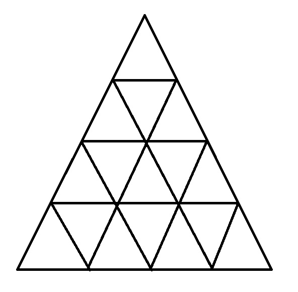

# How Many Triangles?
Solves the **"how many triangles in this shape?"** types of riddles

### Example:



Takes an input of lines made up of indices of nodes (lines intersections) in the shape.
Mark the echo node with a unique index and  create a `Line` from the indices of each actual (full) line in the shape:

```csharp
Line[] example = 
{
    new Line(new List<int>(){ 1, 2 , 3 , 4 , 5  }),
    new Line(new List<int>(){ 1, 9 , 8 , 7 , 6  }),
    new Line(new List<int>(){ 1, 10, 11, 12, 13 }),
    new Line(new List<int>(){ 1, 17, 16, 15, 14 }),
    new Line(new List<int>(){ 2, 9 , 10, 17 }),
    new Line(new List<int>(){ 3, 8 , 11, 16 }),
    new Line(new List<int>(){ 4, 7 , 12, 15 }),
    new Line(new List<int>(){ 5, 6 , 13, 14 })
};


```
